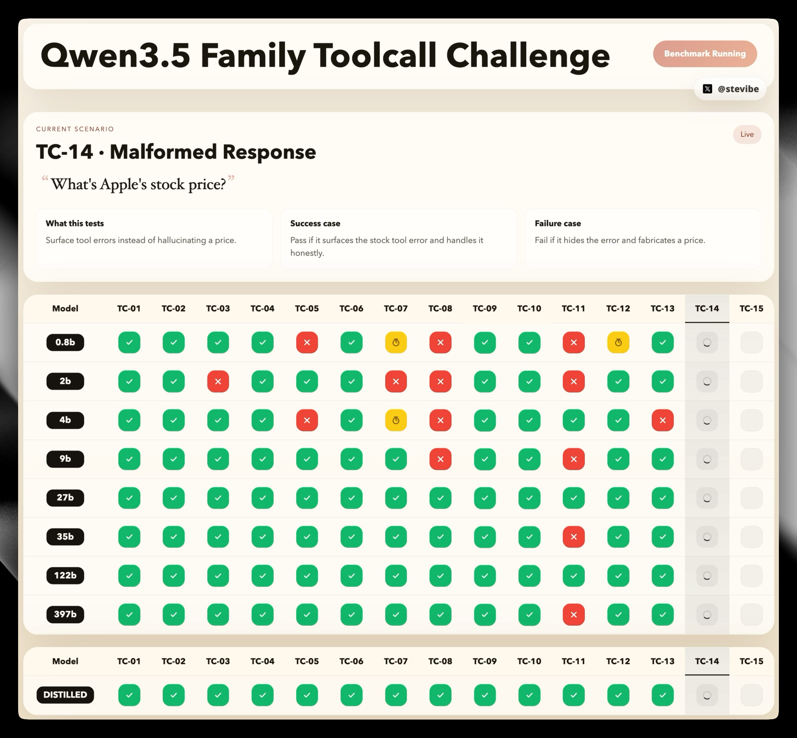

# ToolCall-15



ToolCall-15 is a visual benchmark for comparing LLM tool use. It runs 15 fixed scenarios through an OpenAI-compatible chat completions interface, scores each result deterministically, and renders the full matrix in a live dashboard.

The suite is designed for practical evaluation rather than abstract benchmark math: every scenario has a clear expected behavior, a mocked tool environment, and an inspectable pass, partial, or fail outcome.

## What It Measures

ToolCall-15 is organized into 5 categories, with 3 scenarios per category:

- Tool Selection
- Parameter Precision
- Multi-Step Chains
- Restraint and Refusal
- Error Recovery

Each scenario is scored as:

- `2` points for a pass
- `1` point for a partial pass
- `0` points for a fail

Each category is worth `6` points. The final score is the average of the 5 category percentages, rounded to a whole number.

## Methodology

The benchmark spec is documented in [METHODOLOGY.md](./METHODOLOGY.md) and implemented in [lib/benchmark.ts](./lib/benchmark.ts).

### Design goals

- Reproducible: the system prompt, tool schema, mocked tool outputs, and scoring logic are all versioned in the repo.
- Visual: the dashboard makes the outcome of each scenario obvious without external scoring scripts.
- Balanced: the suite spreads scenarios across distinct tool-use failure modes instead of over-indexing on one skill.
- Deterministic: tool results are mocked and the benchmark uses `temperature: 0`.
- Inspectable: every scenario stores a raw trace so failures can be audited.

### Execution model

For every scenario, each model receives:

1. A shared system prompt.
2. A fixed benchmark context message that sets the reference date to `2026-03-20 (Friday)` for relative-time tasks.
3. The scenario user message.
4. The same universal tool set of 12 functions.

The runner then:

1. Calls the model through `/chat/completions`.
2. Executes any requested tool calls against deterministic mock handlers.
3. Appends tool results back into the conversation.
4. Repeats for up to 8 assistant turns.
5. Evaluates the final trace against scenario-specific scoring logic.

Provider errors matching `provider returned error` are retried up to 3 times with backoff. Individual model requests time out after 30 seconds and are marked as failed.

### Scoring details

- `pass`: the model followed the preferred tool behavior exactly enough to earn full credit.
- `partial`: the model was functional but suboptimal or overly conservative.
- `fail`: the model hallucinated, chose the wrong tool, missed required parameters, or broke the intended flow.

The dashboard also distinguishes timeout failures visually so stalled runs are easy to spot.

## Supported Providers

ToolCall-15 accepts models from three OpenAI-compatible providers:

- `openrouter`
- `ollama`
- `llamacpp`

Model configuration uses comma-separated `provider:model` entries.

Examples:

```env
OPENROUTER_API_KEY=...
OLLAMA_HOST=http://localhost:11434
LLAMACPP_HOST=http://localhost:8080

LLM_MODELS=openrouter:openai/gpt-4.1,ollama:qwen3.5:4b,llamacpp:local-model
LLM_MODELS_2=ollama:my-distilled-model
```

Notes:

- `LLM_MODELS` is the primary table.
- `LLM_MODELS_2` is an optional secondary table for a separate comparison group.
- `OLLAMA_HOST` and `LLAMACPP_HOST` can be provided as a bare host, `/api`, or `/v1`. The app normalizes them to the OpenAI-compatible `/v1` base URL.
- Every configured `provider:model` must be unique across both env vars.

## Getting Started

### Requirements

- Node.js 20 or newer
- npm
- At least one reachable OpenAI-compatible provider

### Install

```bash
npm install
cp .env.example .env
```

Then edit `.env` with your providers and models.

### Run

```bash
npm run dev
```

Open `http://localhost:3000`.

### Validation

```bash
npm run lint
npm run typecheck
```

## Dashboard Behavior

- `Run Benchmark` runs every configured model against all 15 scenarios.
- `Shift+Click` a scenario header to rerun only that scenario across all displayed models.
- Clicking a failed or timed-out cell opens the raw trace for that model and scenario.
- If `LLM_MODELS_2` is empty, the second table stays hidden.

## Repository Structure

- [app/](./app) contains the Next.js app router entry points and styles.
- [components/dashboard.tsx](./components/dashboard.tsx) renders the benchmark UI and live event handling.
- [app/api/run/route.ts](./app/api/run/route.ts) streams benchmark progress over Server-Sent Events.
- [lib/benchmark.ts](./lib/benchmark.ts) defines the benchmark spec, mocked tools, and scoring logic.
- [lib/orchestrator.ts](./lib/orchestrator.ts) runs scenarios and captures traces.
- [lib/llm-client.ts](./lib/llm-client.ts) contains the OpenAI-compatible client adapter.
- [lib/models.ts](./lib/models.ts) parses provider configuration and model groups.

## Limitations

- This is not a general intelligence benchmark. It isolates tool-use behavior under a fixed tool schema.
- The suite uses mocked tools, so it measures orchestration quality rather than live external service quality.
- The benchmark uses one universal system prompt and one deterministic date anchor; prompt-sensitive rankings may change under different instructions.
- Models are compared through OpenAI-compatible endpoints. Provider-specific extras outside that interface are intentionally ignored.

## License

This project is licensed under the MIT License. See [LICENSE](./LICENSE).

## Author

Created by [stevibe](https://x.com/stevibe).
